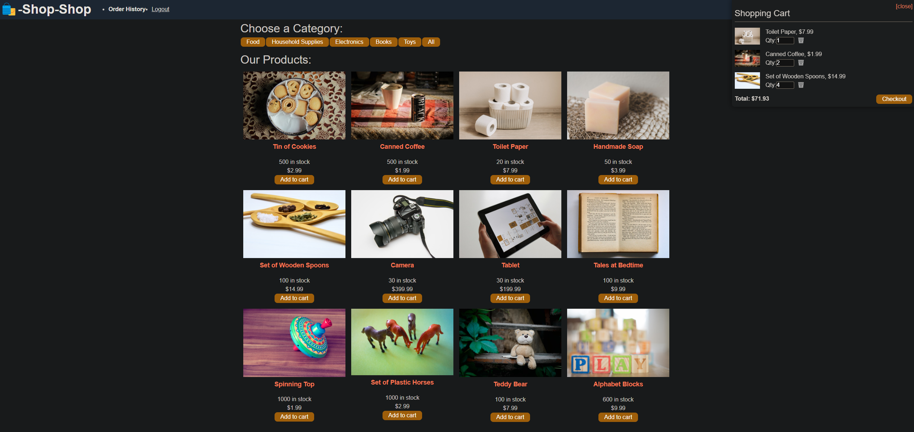

# ReduxRetail

## Description
A full-stack e-commerce platform refactored from React Context API to Redux state management.

## Getting Started

To experience the full functionality of ReduxRetail, you can log in using the seeded user credentials provided below:

- **Email:** `eholt@testmail.com`
- **Password:** `password12345`

Feel free to explore the platform and test out the various features!

## Deployment
[Live Demo on Render](https://redux-retail.onrender.com)



## Technology Migration
### From Context API to Redux
- Removed GlobalState context
- Implemented Redux store with slices:
  - Auth slice for user authentication
  - Cart slice for shopping cart management
  - Category slice for product categories
  - Product slice for product management

### Examples of Client-Side Changes

```javascript
// Before (Context)
import { useStoreContext } from './utils/GlobalState';
const [state, dispatch] = useStoreContext();

// After (Redux)
import { useDispatch, useSelector } from 'react-redux';
const dispatch = useDispatch();
const { cart } = useSelector(state => state.cart);
```

### Server-Side Updates
- Enhanced JWT authentication
- Added Redux-compatible resolvers
- Updated Stripe integration
- Improved error handling

### Features
- Redux state management
- JWT authentication
- Shopping cart persistence
- Stripe payment integration
- Category filtering
- Order history